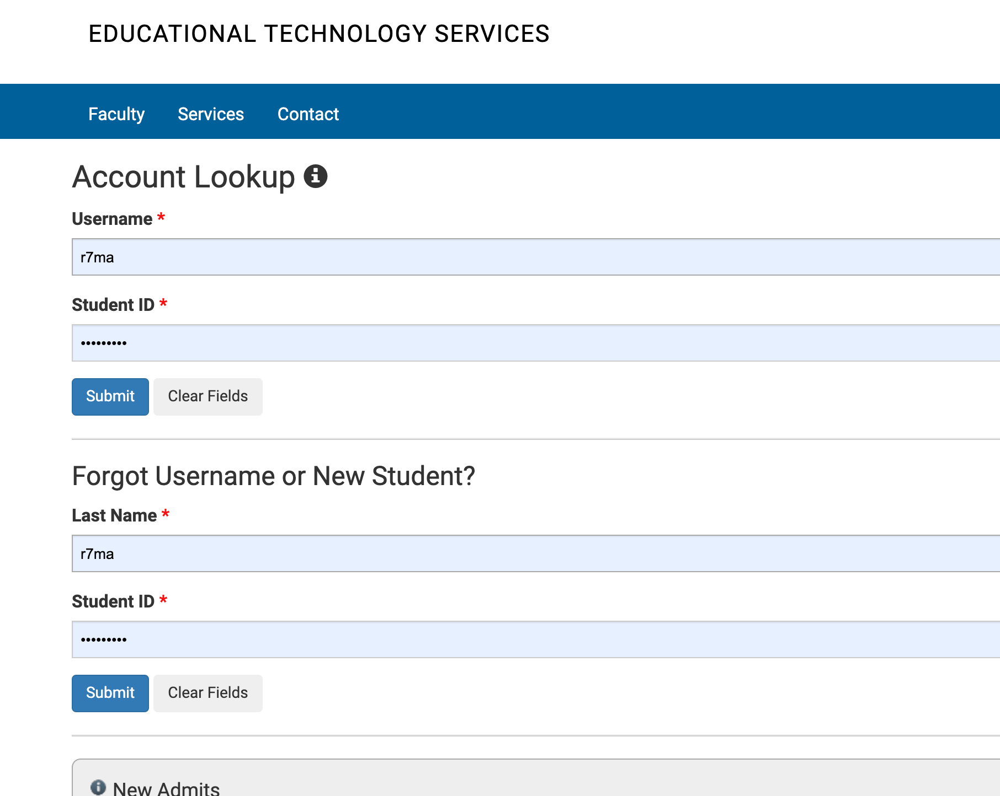
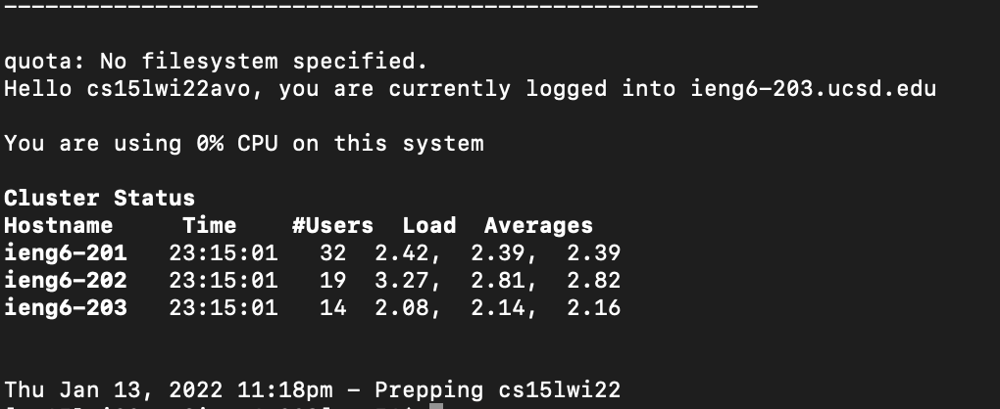
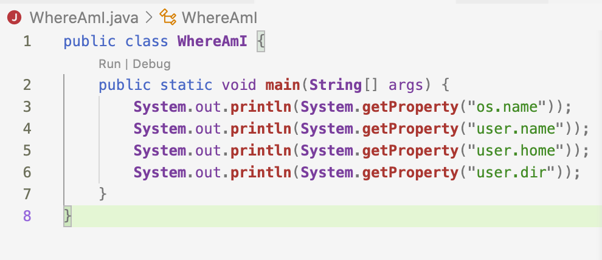
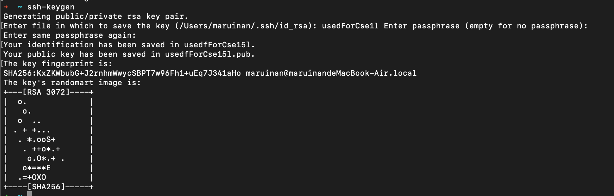
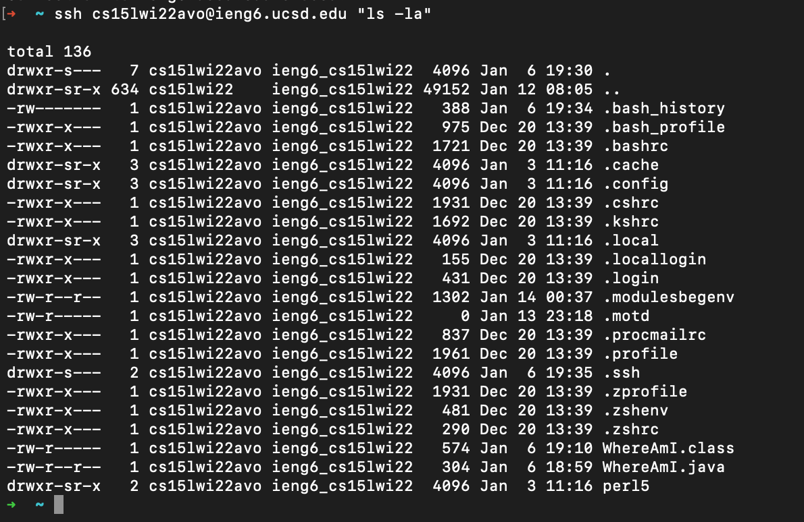
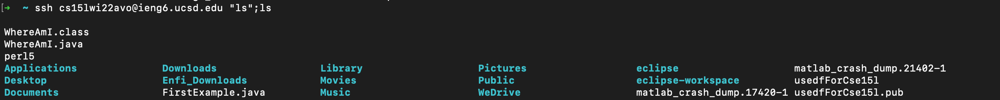

# ieng6 tutorial for CSE 15L  
## by Michael Ma
   
## Step 1: Installing VScode
---   
* Go to the Visual Studio Code website [https://code.visualstudio.com/](https://code.visualstudio.com/) to install VScode on your computer.   

  

## Step 2: Remotely Connecting  
---  

* If you're on Windows: install [OpenSSH](https://docs.microsoft.com/en-us/windows-server/administration/openssh/openssh_install_firstuse)  
* Then, look up your course-specific account for CSE15L here: [https://sdacs.ucsd.edu/~icc/index.php](https://sdacs.ucsd.edu/~icc/index.php)  (You need to change your local password for the first time.)  
  

* Open the terminal in VScode (to do this, Ctrl or Command + `, or use the Terminal → New Terminal menu option), type in the following command (ignore the dollar sign).  

```
 $ ssh cs15lwi22zz@ieng6.ucsd.edu
```
*Note: you need to change the* `zz` *with corresponding letters of your own account.*  

* Some wired message will appear the first time you login like this:  
```
⤇ ssh cs15lwi22zz@ieng6.ucsd.edu
The authenticity of host 'ieng6.ucsd.edu (128.54.70.227)' can't be established.
RSA key fingerprint is SHA256:ksruYwhnYH+sySHnHAtLUHngrPEyZTDl/1x99wUQcec.
Are you sure you want to continue connecting (yes/no/[fingerprint])? 
```
Just type `yes`, you will be fine. If everything went well, you will see the following message:  
  
* Now you have seccessfully login to ieng6!

## Step 3: Trying Some Commands  
---  


You cannot open folders (or directories) by double clicking corresponding icons, like on your own computer, in ieng6. But you can access, upload, and download files by using commands. 

Now try the following commands, could you figuring out their functions? If you got stuck, you might find the answer [here](https://hackr.io/blog/basic-linux-commands).  

Please try:  

* `ls`  
* `ls -a`  
* `ls -lat`  
* `ls <directory>`  (`<directory>` is `/home/linux/ieng6/cs15lwi22/cs15lwi22zz`, replace `zz` with corresponding letters of your own account).  
* `cd`  
* `cd <directory>`  
*Discuss with your peers: could you ls the directory if you change your account letter to something else?* 
* `cp /home/linux/ieng6/cs15lwi22/public/hello.txt ~/`  
* `cat /home/linux/ieng6/cs15lwi22/public/hello.txt` 

To log out, you can use  `Ctrl + D` or run `exit`. 

## Step 4: Moving Files with `scp`  
---  
* Create a simple java file on your local desktop, like this:  
  
*Discuss with your peers: what you saw after run `javac` and `java` like you did in CSE8B/CSE11?*  

* Then, run the following command:  
`scp WhereAmI.java cs15lwi22zz@ieng6.ucsd.edu:~/`  

*think: what does `~` means?*  

* You will be asked to input your passward like in step3. 

* Then, `ssh` to ieng6 again, run `javac` and `java` in ieng6. Is the printed message same as when you run this in local?  *Discuss with your peers*  
  
* What different could you figure out after running one of the `ls` command now?  
  
* Discuss with your peers, what do you think `scp` command actually did?  
  

## Step 5: Setting an SSH Key  
---  
*How long did it take you to `ssh` once?*  
* You might find it really time-comsuming to input the password repeatedly. 

* Luckily there is a certain way to let the server "recognize you".  

* The `ssh-keygen` generate a public key and a private key. You can `scp` the public key to the server, and use the private key to "unlock" the server whenever you want to login.   

* Try: run the following command:  
  
*You need to name the key you generated this time.*  
*For the passphrase, you just need to leave it as blank.*
* Copy the directory in which your keys were located.  
* Now, a public key and a private key have been generated. You need to `scp` the public key to your directory in ieng6. Do it now.  

`$ ssh cs15lwi22zz@ieng6.ucsd.edu`  
`<Enter Password>`  
`$ mkdir .ssh`  
`$ exit`  
`# back on client`  
`$ scp <Paste the key's directory here>/id_rsa.pub`   `cs15lwi22@ieng6.ucsd.edu:~/.ssh/authorized_keys`  
  
**You need to use your username and the path you saw in the command above**

* `mkdir .ssh` means "make a directory named '.ssh'".   

Now, you can login ieng6 without entering the password.  

* Try to `ssh` again, if you can login without the password, you are done.  

## Step 6: Optimizing Remote Running  
---  

We can further improve remote running.  

* Try to add a command (i.e.`ls`) after ssh login command, like:  

  

**This allow you to do some command on the remote severe without explicitly login and log out.**  

* Try to use `;` to seperate different commands, what will happen?  

  

* The `;` did nothing more than allow you to type in all commmands first, and run them one-by-one. If you have used MATLAB, you might find it familar.  

*in this case, the command after the `;` just list files and directories in your current home directory*


  
---
>**Now you might be more familar with ieng6!**
  
>**If not, try to explore it with your peers! Wish you could succeed in CSE 15L!**  