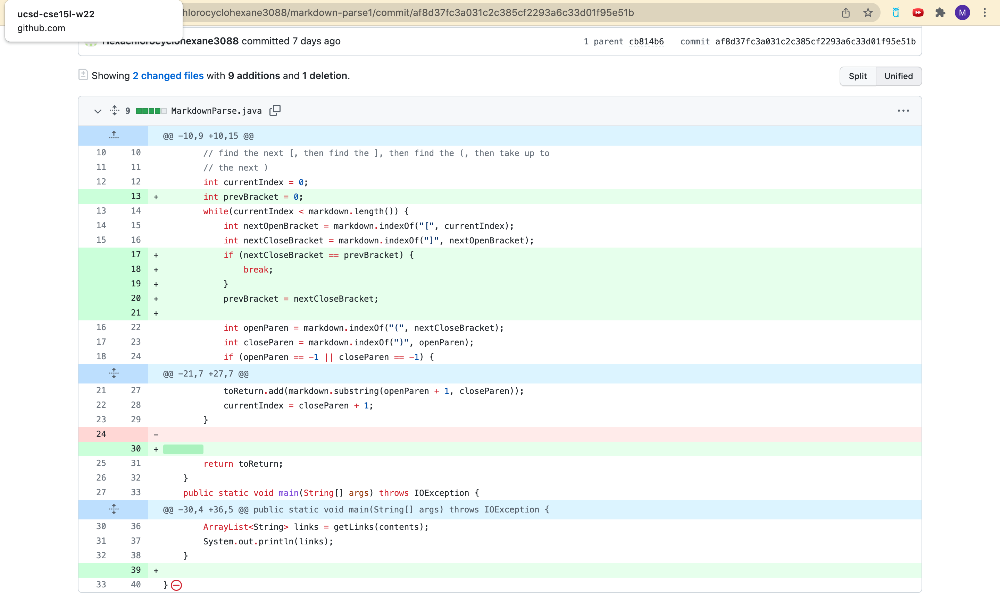
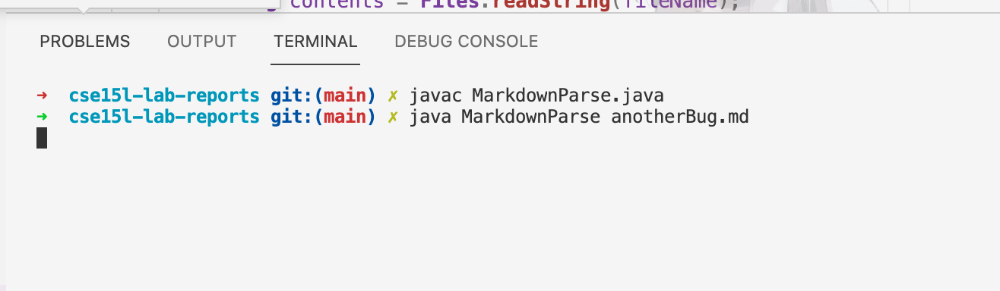

# Lab Report 2  
## by Michael Ma
1. Change 1 (By Michael Ma)
     
[Failure Inducing Input](https://github.com/Hexachlorocyclohexane3088/markdown-parse1/blob/11de2a777b5a3a567762e0a882d9311c613b2259/anotherBug.md)  
Symptom: 
When nested parentheses occur, the program would go in an infinite loop.   
The output is as the following screen shot.  
     
The bug is caused by, if there were nested parentheses and only one bracket the indexOf method would always search from the same position (the index of the closing bracket).    
Sympton is nothing will be printed and the program would not stop util we press ctrl+c to terminate the program manually.  
The failuare inducing input have only one bracket and two nested parentheses, which would cause the bug.  

2. Change 2 (By Michael Ma)
   
[Failure Inducing Input]()  
Symptom:   
When there are no () followed by [], the indexoutofbound exception would be thrown.  
The output is as the following screen shot.  
     

