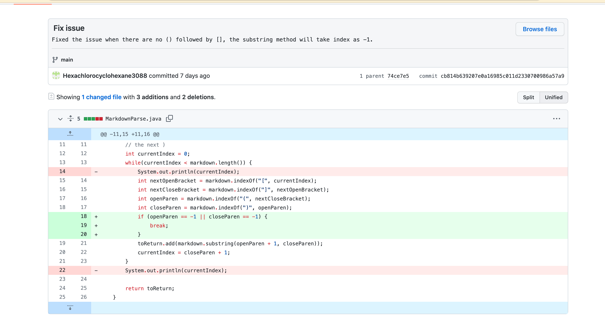
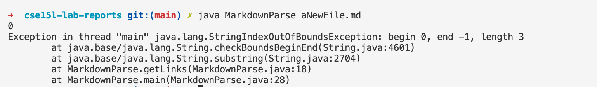

# Lab Report 2  
## by Michael Ma
1. Change 1 (By Michael Ma)
     
[Failure Inducing Input](https://github.com/ucsd-cse15l-w22/markdown-parse/blob/2c9300a80518830d534650fc765f4731e4f1c2e9/test-file2.md)  
Symptom: 
The program went in infinite loop.     
The output is as the following screen shot.  
     
The bug is caused by, if there texts after the last link, the indexOf method searching for open brackets would return -1, since there are no open brackets after the last link.However, the next indexof method, which search for close brackets, would not return -1, since it just wrap up to the beginning of the file, and search after -1. So a infinite loop would occur.   
Sympton is nothing will be printed until the stack memory were used up.  
The failuare inducing input have texts after the second link parentheses, which would cause the bug.  

2. Change 2 
   
[Failure Inducing Input](https://github.com/ucsd-cse15l-w22/markdown-parse/blob/2c9300a80518830d534650fc765f4731e4f1c2e9/test-file3.md)  
Symptom:   
When there are no () followed by [], the indexoutofbound exception would be thrown.  
The output is as the following screen shot.  
     
The bug is caused by, if there are no () followed by [], the indexOf method would return -1 when searching for "(" or ")". So the substring method would take index as -1, which is not allowed. So the exception is thrown. 
The sympton is exception is thrown.  
The faluare unducing input have no () so the indexOf method would return -1, which cause the exception to be thrown.  

3. Change 3 (By Takuro Kitazawa)  
   
[Failure Inducing Input](https://github.com/audreyfishy/markdown-parse/blob/a755c0298943680d8902cdeb2fa4a30957a3eace/breaking.md)  
Symptom:   
When there are no closing parentheses but have a open parentheses, the indexoutofbound exception would be thrown.  
The output is as the following screen shot.  
     
The bug is caused by, if there are no closing parentheses , the indexOf method would return -1 when searching for ")". So the second paramenter of the substring method would take index as -1, which is not allowed. So the exception is thrown. (Really a same issue with the previous one)
The sympton is exception is thrown.  
The faluare unducing input have no ) so the indexOf method would return -1, which cause the exception to be thrown when calling the substring method.  

