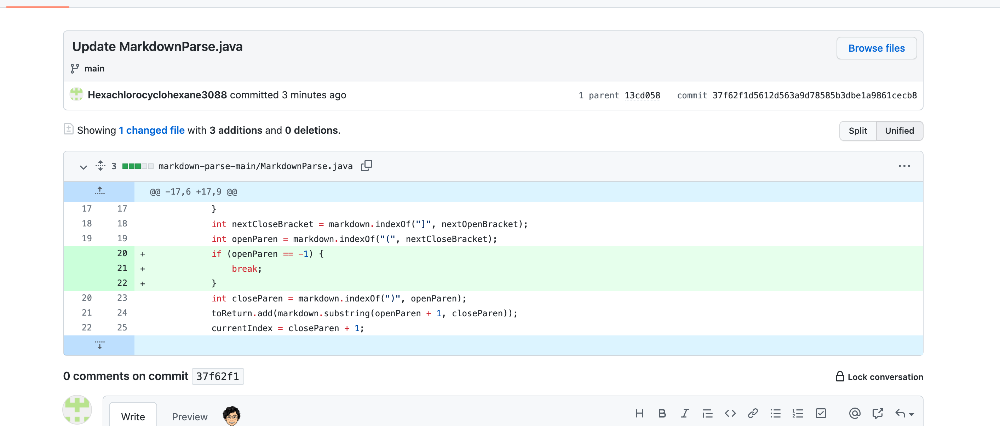

# Lab Report 2  
## by Michael Ma
1. Change 1 (By Michael Ma)
     
[Failure Inducing Input](https://github.com/ucsd-cse15l-w22/markdown-parse/blob/2c9300a80518830d534650fc765f4731e4f1c2e9/test-file2.md)  
Symptom: 
An outOfMemoryError is thrown, and nothing is printed.     
The output is as the following screen shot.  
     
The bug is caused by, if there texts after the last link, the indexOf method searching for open brackets would return -1, since there are no open brackets after the last link.However, the next indexof method, which search for close brackets, would not return -1, since it just wrap up to the beginning of the file, and search after -1. So a infinite loop would occur.   
Sympton is nothing will be printed until the heap memory were used up.  
The failuare inducing input have texts after the second link parentheses, which would cause the bug.  
Here we could fix this bug by adding a if statement to determine whether there is a open bracket after the start  index. If -1 is detected, it means there are no open parentheses exists after the current start index, so we just break the while loop.  

2. Change 2 
   
[Failure Inducing Input](https://github.com/ucsd-cse15l-w22/markdown-parse/blob/2c9300a80518830d534650fc765f4731e4f1c2e9/test-file3.md)  
Symptom:   
The StringIndexOutOfBoundsException is thrown.  
The output is as the following screen shot.  
     
The bug is caused by, if there are no () followed by [], the indexOf method would return -1 when searching for "(" and ")". So the substring method would take index as -1, which is not allowed. So the exception is thrown. 
The sympton is exception is thrown.  
The faluare unducing input have no () so the indexOf method would return -1, which cause the exception to be thrown.  
We could fix this problem by adding another if statement to determine whether the open parentheses exist. If not,  i.e.  the indexof method return -1, we would break, instead of calling the substring method.  

3. Change 3 
   
[Failure Inducing Input](https://github.com/Hexachlorocyclohexane3088/markdown-parse1/blob/main/markdown-parse-main/test-file8.md)  
Symptom:   
An outOfMemoryError is thrown, and nothing is printed.    
The output is as the following screen shot.  
     
Similar as the first change, we went in a infinite loop, and consuming up the heap space. The bug is caused by, if there are no closing brackets , the indexOf method would return -1 when searching for "]". So when the indexOf method search for "(", it would search from -1, which is the same location as the first "(".  So an infinite loop occurs.  
The sympton is the error is thrown.  
The faluare unducing input have no "]" after a "[" , so the loop would not break at the first if statement.  
We fixed this bug simply by adding another if statement so that the while loop would break if detecting no "]".    

## Thank you for reading!  
   