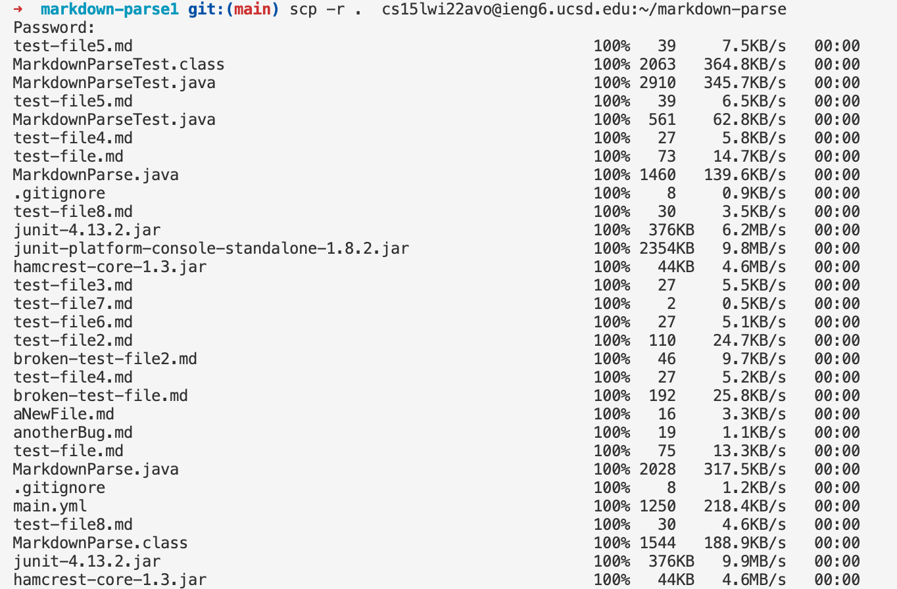
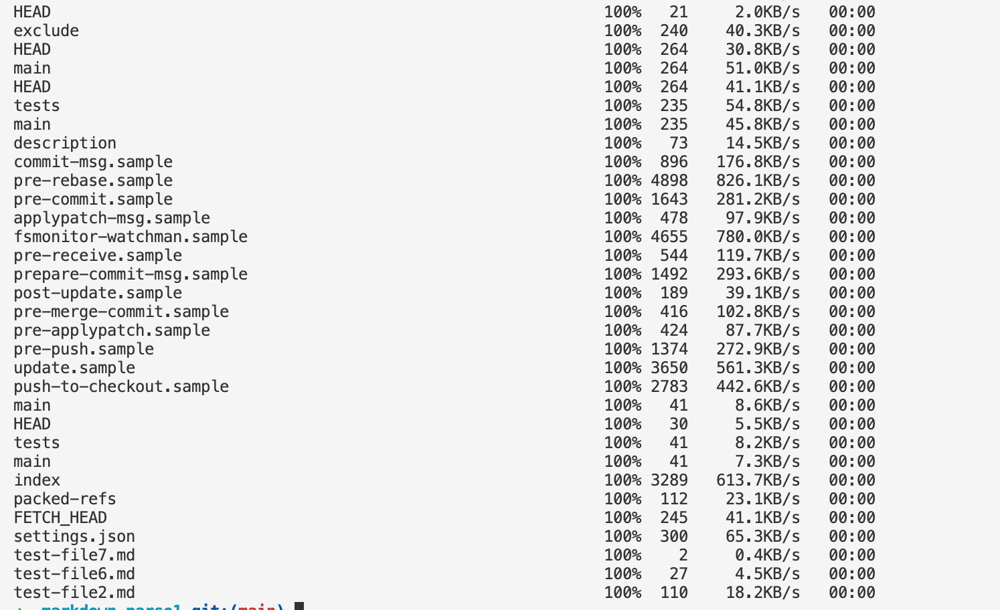

# Lab Report 2  
## by Michael Ma
**Copy whole directories with** `scp -r`  
1. copying markdown-parse directory to our ieng6 account  
* Using command `scp -r . cs15lwi22avo@ieng6.ucsd.edu:~/markdown-parse` to copy the markdown-parse directory to ieng6. Since we are in this directory, we use `.` as path.  

* Then use `ssh` to login ieng6, and use `cd` to enter the directory which we have copied. `javac` and `java` to compile and run tests.  
