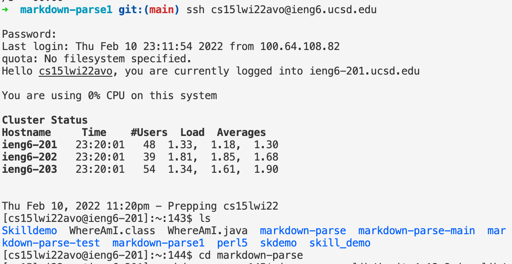
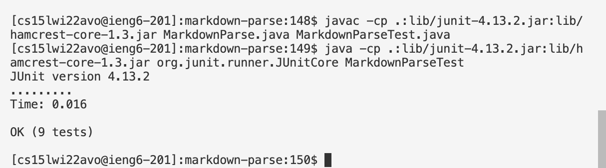
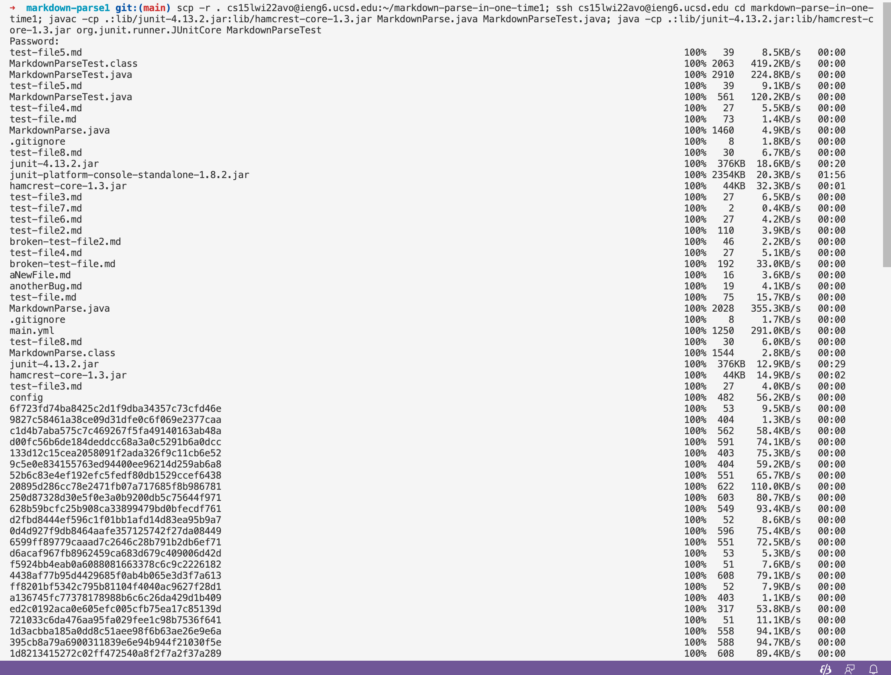
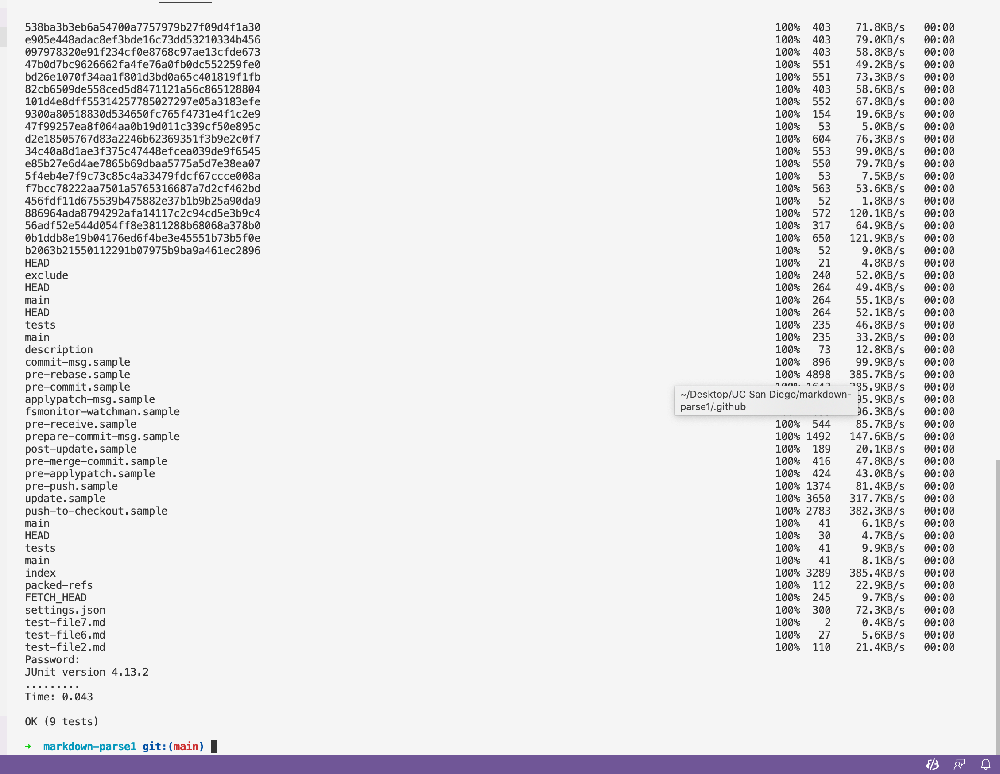

# Lab Report 3  
## by Michael Ma
**Copy whole directories with** `scp -r`  
1. copying markdown-parse directory to our ieng6 account  
* Using command `scp -r . cs15lwi22avo@ieng6.ucsd.edu:~/markdown-parse` to copy the markdown-parse directory to ieng6. Since we are in this directory, we use `.` as path.  


2. login ieng6 and run the tests.  
* Use `ssh` to login ieng6, and use `cd` to enter the directory which we have copied. `javac` and `java` to compile and run tests.  
 
  
3. Improve by combining them as one command.  
* Step 1 and 2 could achieve our goal, but could we compress them? 
* In fact, we could use `;` to compress commands, so the combined command would be:  
```
scp -r . cs15lwi22avo@ieng6.ucsd.edu:~/markdown-parse-in-one-time1; ssh cs15lwi22avo@ieng6.ucsd.edu cd markdown-parse-in-one-time1; javac -cp .:lib/junit-4.13.2.jar:lib/hamcrest-core-1.3.jar MarkdownParse.java MarkdownParseTest.java; java -cp .:lib/junit-4.13.2.jar:lib/hamcrest-core-1.3.jar org.junit.runner.JUnitCore MarkdownParseTest
```   
Here, we use a `;` to separate each commands, except for one following `ssh`. Otherwise, the commands after `ssh` would not run until we exit ieng6.  
The results are as below:  

  

## Thank you for reading!  
   