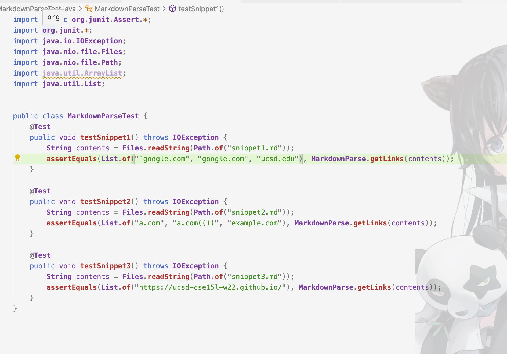
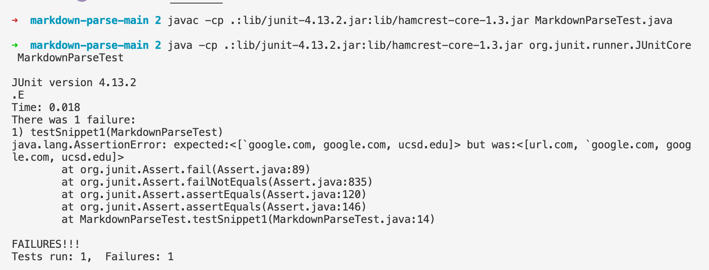
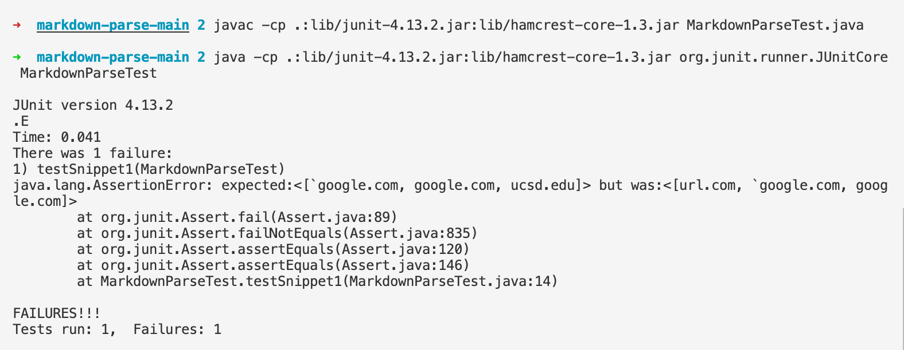
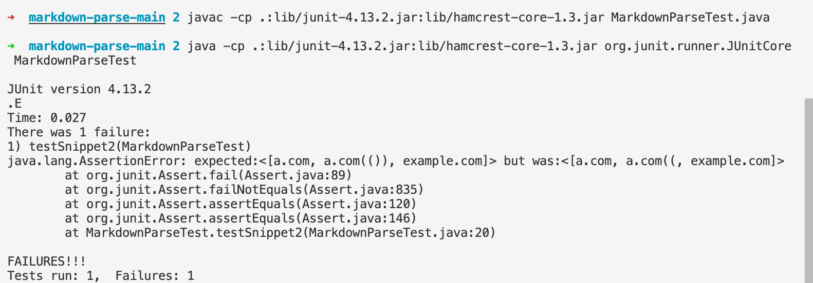
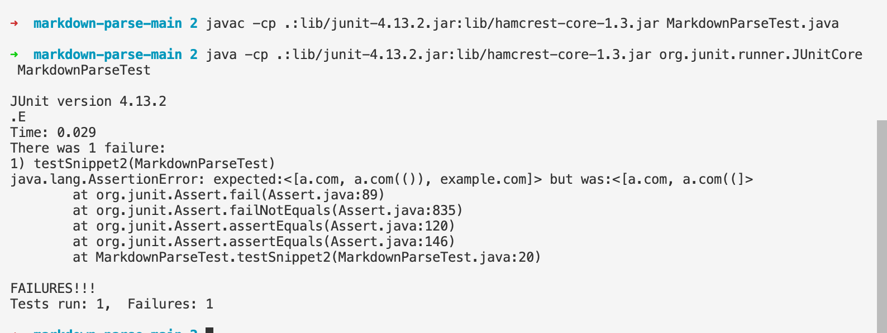
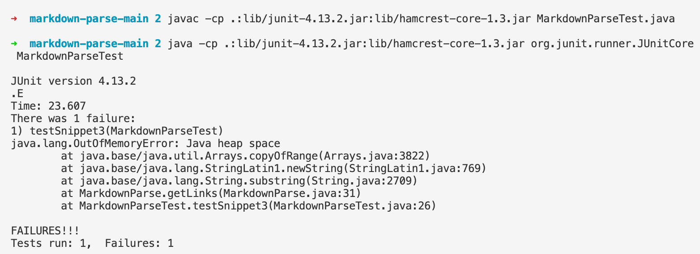
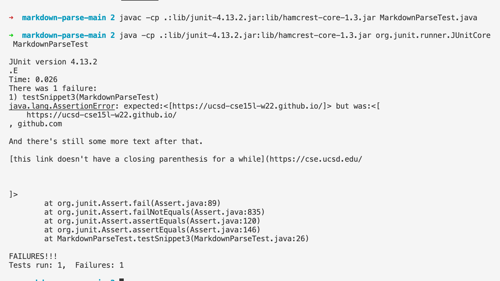

# Lab Report 4  
## by Michael Ma
**Code Review**  
Link to [My markdown-parse repository](https://github.com/Hexachlorocyclohexane3088/markdown-parse1) and a link to [the one we reviewed](https://github.com/aajc/markdown-parse)  
Code used for testing: (Commenting off the tests methods that are not using each time before run the test)

Unfortunately none of the tests passed.  
## Snippet 1
```
`[a link`](url.com)

[another link](`google.com)`

[`cod[e`](google.com)

[`code]`](ucsd.edu)
```
**Excepted ouput:**  
```
["`google.com","google.com","ucsd.edu"]
```
**Other group output:**  
  
**My out put:**   
  
## Snippet 2
```
[a [nested link](a.com)](b.com)

[a nested parenthesized url](a.com(()))

[some escaped \[ brackets \]](example.com)
```
**Excepted ouput:**  
```
["a.com","a.com(())","example.com"]
```
**Other group output:**  
  
**My out put:**  
 

## Snippet 3
```
[this title text is really long and takes up more than 
one line

and has some line breaks](
    https://www.twitter.com
)

[this title text is really long and takes up more than 
one line](
    https://ucsd-cse15l-w22.github.io/
)


[this link doesn't have a closing parenthesis](github.com

And there's still some more text after that.

[this link doesn't have a closing parenthesis for a while](https://cse.ucsd.edu/


)

And then there's more text
```
**Excepted ouput:**  
```
["https://ucsd-cse15l-w22.github.io/"]
```
**Other group output:**  
    
**My out put:**  
  
