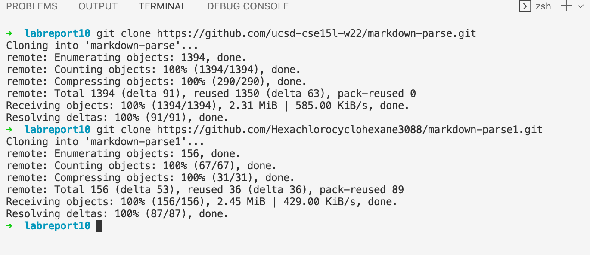
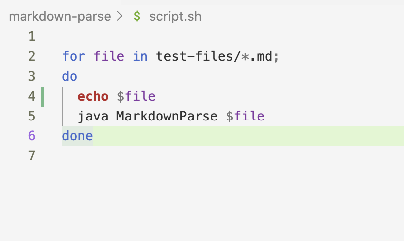
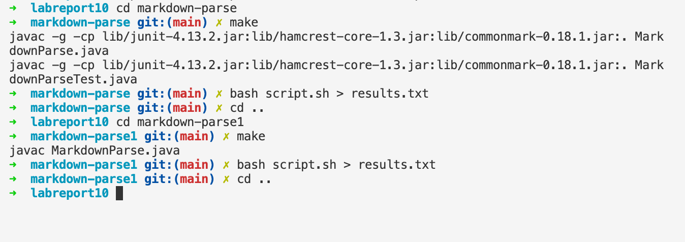
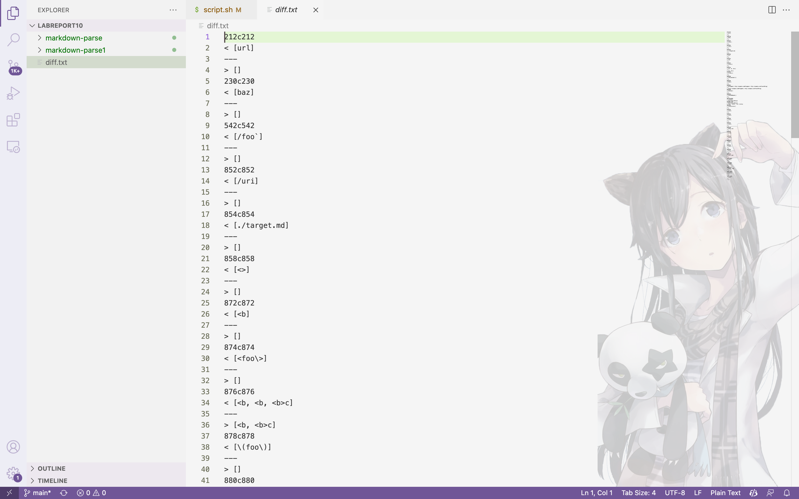
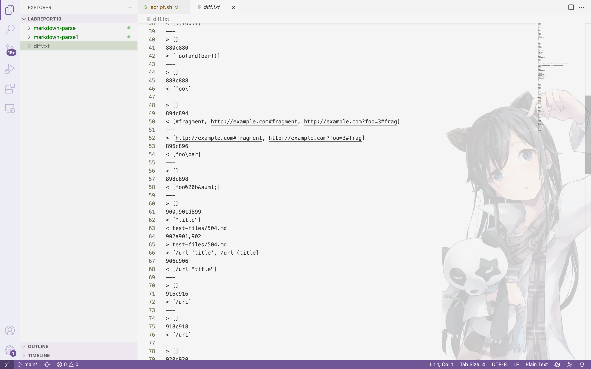
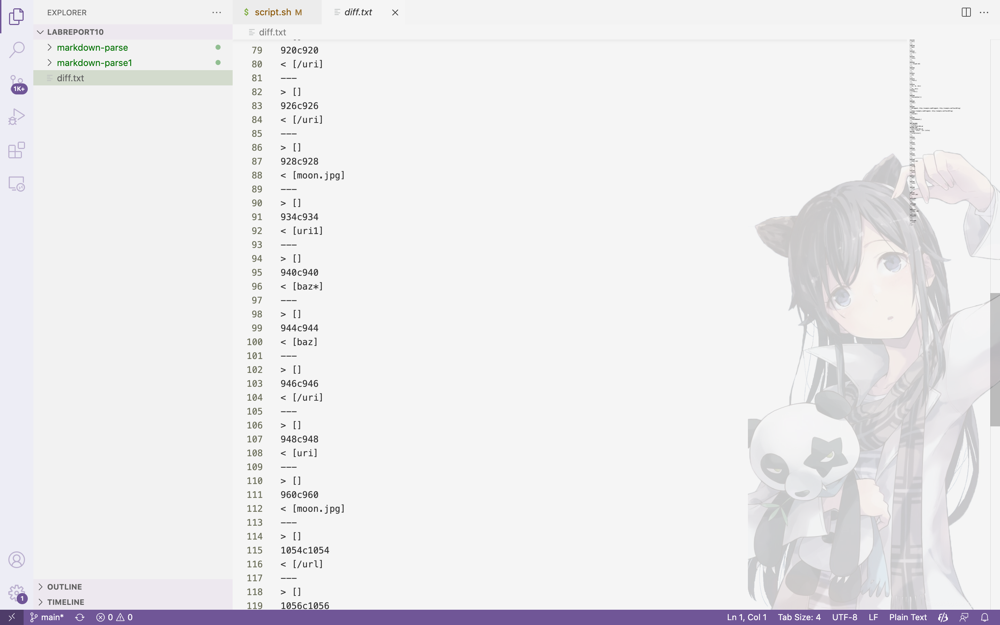
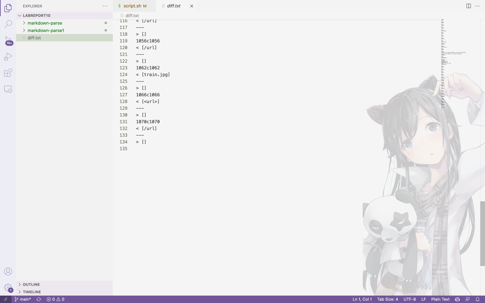

# Lab Report 5  
## by Michael Ma
**Different Bugs**  
Link to [My markdown-parse repository](https://github.com/Hexachlorocyclohexane3088/markdown-parse1) 

So first we create a directory and clone my repo and the given repo, using same strategy we did in lab9.   
Here markdown-parse is the given repo, while markdown-parse1 is my own repo.     

## Run the Tests   
Add a line `echo $file` in `script.sh` like we did in lab9, so that it is easier for us to find which test an output is correspond to.  
  
Using `scp` to copy `script.sh` and `test-files` from the given to my repo.  
![images/report5_scp.png]  
Enter each directory and run `make` and `bash script.sh > results.txt`, after a while we got the output storing in a new file named "results.txt".   

## Compare the results  
Go back to home directory and use the `diff` to compare results:  
```
diff markdown-parse/results.txt markdown-parse1/results.txt > diff.txt 
```
The result is then stored in a txt file with name `diff.txt`:  




We would like to examine the these two differences:  
Difference in line 10
## First test 
The corresponding to file `201.md`(we could look for that using `cat`). 
The content in `201.md` is 

We could use [the CommonMark demo site](https://spec.commonmark.org/dingus/) to determine the correct output. 
We could figure out that nothing is parsed, so the correct output should be 
```
[]
```
The given 

## Thank you for reading!  
   