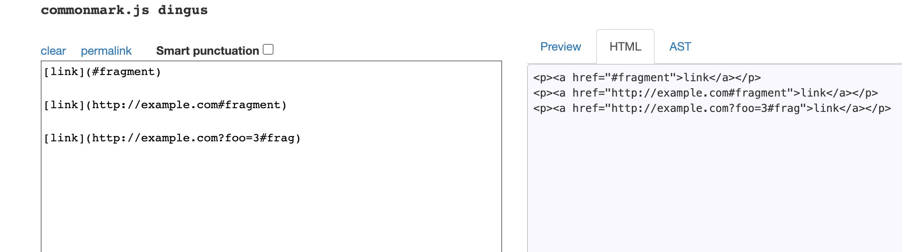

# Lab Report 5  
## by Michael Ma
**Different Bugs**  
Link to [My markdown-parse repository](https://github.com/Hexachlorocyclohexane3088/markdown-parse1) 

So first we create a directory and clone my repo and the given repo, using same strategy we did in lab9.   
Here markdown-parse is the given repo, while markdown-parse1 is my own repo.     

## Run the Tests   
Add a line `echo $file` in `script.sh` like we did in lab9, so that it is easier for us to find which test an output is correspond to.  
  
Using `scp` to copy `script.sh` and `test-files` from the given to my repo.  
![images/report5_scp.png]  
Enter each directory and run `make` and `bash script.sh > results.txt`, after a while we got the output storing in a new file named "results.txt".   

## Compare the results  
Go back to home directory and use the `diff` to compare results:  
```
diff markdown-parse/results.txt markdown-parse1/results.txt > diff.txt 
```
The result is then stored in a txt file with name `diff.txt`:  


We would like to examine the these two differences:  
Difference in line 1070: 
.png)
And difference in line 894:  


## First Test (output in line 1070)
We could open the `results.txt` in either directory. 
Go to line 1070, we could find that it is the output of test on `580.md`.  

This is the content of `580.md`:  

From the output of the script, we could tell that output of my `MarkdownParse.java` is `[]`, while output of the given `MarkdownParse.java` is `[/url]`.  
We could determine the actual output by the following:  
  
So the actual output coincide with what we have concluded. 
We could use [the CommonMark demo site](https://spec.commonmark.org/dingus/) to determine the correct output. 

We could figure out that no link is parsed(in fact it is trying to parse a image), so the correct output should be 
```
[]
```
Output of my `MarkdownParse.java` is correct, while the output of the given `MarkdownParse.java` is incorrect.  
This is because, in the given `MarkdownParse.java` , there is no code being implemented to detect `!` before the `[`, which if present, we should jump to the next potential link. (`!` before `[` indicates a image instead of a link).  
  


Hence some code eliminating image link should be added.  

## Second Test (output in line 894)  
We could open the `results.txt` in either directory. 
Go to line 894, we could find that it is the output of test on `500.md`.  

This is the content of `500.md`:  

From the output of the script, we could tell that output of my `MarkdownParse.java` is `[http://example.com#fragment, http://example.com?foo=3#frag]`, while output of the given `MarkdownParse.java` is `[#fragment, http://example.com#fragment, http://example.com?foo=3#frag]`.  
We could determine the actual output by the following:  
  
So the actual output coincide with what we have concluded. 
We could use [the CommonMark demo site](https://spec.commonmark.org/dingus/) to help determine the correct output. 

Three links are parsed, which are
```
[#fragment, http://example.com#fragment, http://example.com?foo=3#frag]
```
Output of the given `MarkdownParse.java` is correct, while the output of my `MarkdownParse.java` is incorrect.  
This is because, in my `MarkdownParse.java` , there is some code used to eliminate image from being parsed (finding `!` before `[` and continue).

 However, this would lead to error if the first char in the file is the open bracket of the first valid link. In this case, `nextOpenBracket` is 0, so ` if (!(markdown.charAt(nextOpenBracket-1) == '!'))` would lead to `IndexOutOfBoundsException`, which would be catched, and skip this open bracket. So the first link is not parsed by my `MarkdownParse.java`. The code shown above should be fixed.  
 
## Thank you for reading!  
   